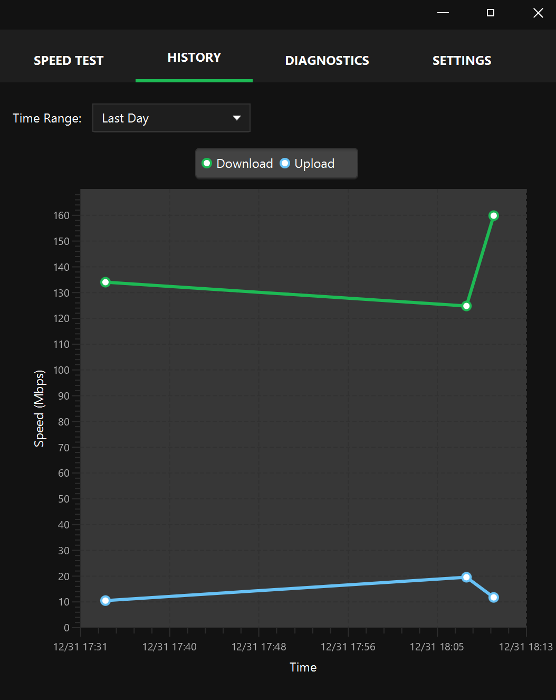
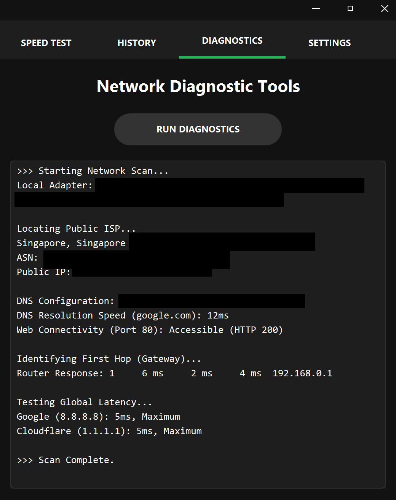
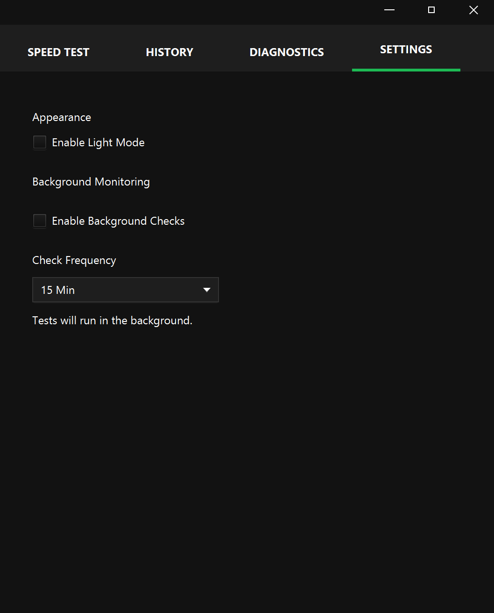
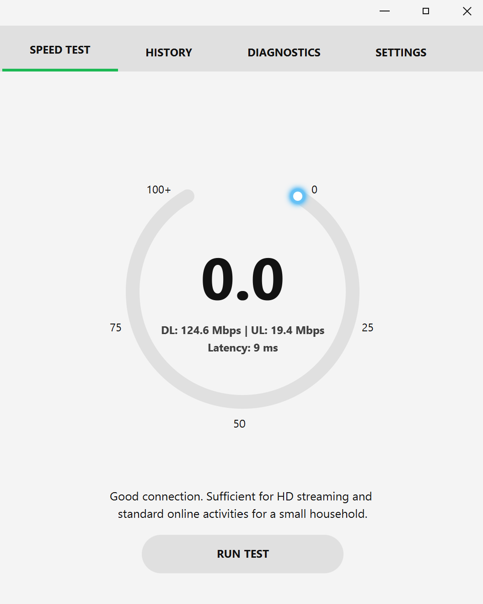

# NetPulse

Welcome to **NetPulse**, a network utility application designed for internet speed testing and network system diagnostics. 
Built with a Spring Boot backend and a modern JavaFX frontend, NetPulse bridges the gap between simple browser tests and complex network analysis tools.

<p>
  <a href="https://github.com/IZO-Ong/netpulse/releases">Download Latest Release</a>
</p>

<p>
  
  
  
  
</p>

---

## Features

- **Live Speed Testing** — Real-time download and upload measurements with instant feedback.
- **Deep Diagnostics** — Scans for DNS latency, ISP location, ASN data, and web reachability.
- **Persistent History** — Built-in local database (H2/JPA) to track your connection performance over time.
- **System Integration** — Direct interaction with OS networking tools for accurate ping and traceroute data.

---

## Architecture
```commandline
JavaFX UI (NetPulseController)
             │          │
             ▼          ▼
    SpeedTestService  DiagnosticService ──► System OS (Ping/Tracert)
             │          │
             ▼          ▼
    SpeedRepository ◄── HTTP Client (OkHttp) ──► External APIs
             │
             ▼
      H2 Local Database
```

---

## Features

### Speed Test
Utilises **OkHttp** for high-concurrency data streaming to measure true throughput: Calculates average Mbps while providing real-time "instant" updates to the UI thread.

### Diagnostic Suite
Integrates multiple layers of network verification:
- **Application Layer:** HTTP HEAD requests to verify global web reachability.
- **Transport Layer:** DNS resolution timing and server identification.
- **Network Layer:** OS-level process execution for Hop 1 (Gateway) response times and global latency.

---

## Application Structure

### Speed Test Tab


- Visual gauges for download and upload speeds.
- Real-time latency (ping) tracking.
- One-click testing with visual progress indicators.
- Descriptive feedback based on test results.

### History Tab


- View all past speed tests visualised on a line chart.
- Filter according to a specific time range.

### Diagnostics Tab


- Full hardware adapter identification.
- Public IP, ISP, and ASN mapping.
- DNS resolution speed testing.

### Settings Tab


- Toggle an automated service that periodically checks connection health without user intervention.
- Seamlessly switch between the default Dark Mode and Light Mode.
  


---

## Getting Started

### Prerequisites
- **Java 21** must be installed on your system.
- For Windows users, ensure you have permissions to run `ping` and `tracert` in your terminal.

### 1. Download and Run
1. Go to the [Releases](https://github.com/IZO-Ong/netpulse/releases) page.
2. Download the `netpulse-0.0.1-SNAPSHOT.jar`.
3. Launch the application:
```bash
java -jar netpulse-0.0.1-SNAPSHOT.jar
```

### 2. Build from Source
```bash
git clone [https://github.com/IZO-Ong/netpulse.git](https://github.com/IZO-Ong/netpulse.git)
cd netpulse
mvn clean package
java -jar target/netpulse-0.0.1-SNAPSHOT.jar
```

---
## Tech Stack
- Frontend: JavaFX, FXML, CSS3 
- Backend: Spring Boot 3.4.0, Spring Data JPA 
- Database: H2 (Embedded)
- Networking: OkHttp 4.x 
- Build Tool: Maven
---

## About
- Created by Isaac Ong

---

## License
See [LICENSE](LICENSE).